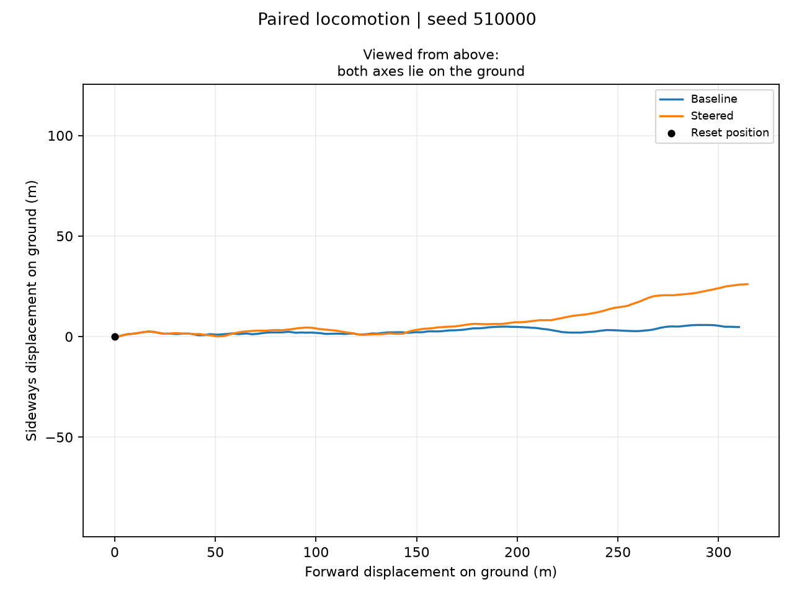
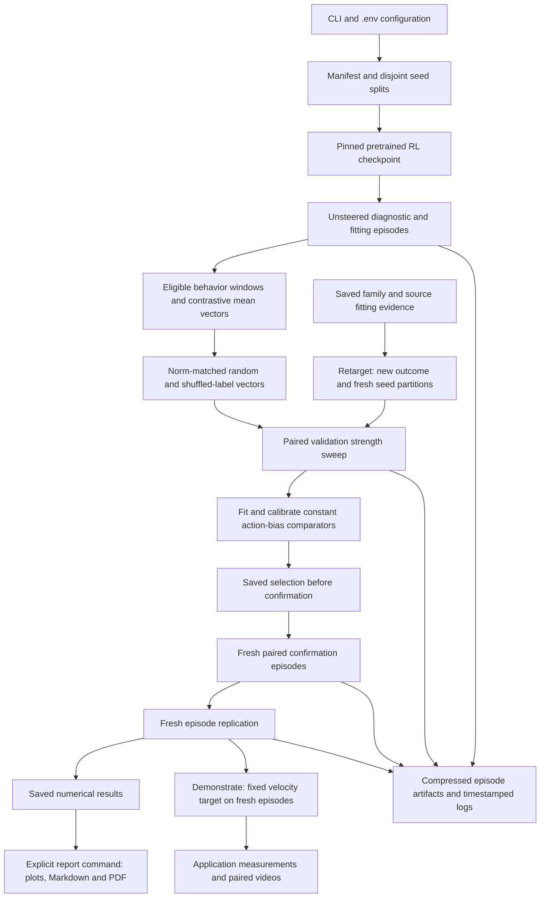

# RL locomotion steering vectors

This project tests whether adding a constant vector to a frozen reinforcement-learning policy's hidden activations can produce useful changes in locomotion. The first implementation collects unsteered rollouts, extracts contrasting activation means, selects intervention strengths on validation episodes, and checks them on fresh paired episodes. It uses **no behavioral cloning** and does not update the pretrained policy's weights.

The scientific objective is a useful, repeatable causal effect, rather than a particular speed change. HalfCheetah candidates concern speed, torso height, and action effort; Ant also enables lateral movement and turning. A nearly constant behavior is an extraction diagnostic, not proof that hidden-state steering is impossible. See [the experiment protocol](docs/methodology.md) for the contrast rules, controls, usefulness thresholds, and limitations. [The experiment register](reports/experiments.md) records measured progress; planned capabilities are not results.

## Featured experiment: Ant travels further sideways

Adding the saved 256-dimensional **lateral vector at strength −0.1** to the frozen Ant actor's first ReLU changes its ground-plane trajectory. On **30 fresh paired confirmation episodes**, mean world-Y velocity increases by **0.402 m/s** (paired 95% bootstrap interval **[0.308, 0.491]**), with **96.83% of mean forward speed retained**. These are equal-episode summaries of available post-onset motion, with a zero-summary convention for an episode ending before onset. The [saved confirmation results](reports/ant-classic-005/results.json) and [independent recomputation](reports/ant-classic-005/math-audit.json) support these numbers. This is sideways displacement relative to the world's axes; it can involve a changed heading and does not establish body-relative sidestepping or jumping.

The [independent code and data audit](reports/ant-classic-005-causal-audit.md) reproduced the vector from fitting data, checked split separation, reconstructed SAC actions, and replayed the recorded physics. It found a constant hidden-activation addition followed by ordinary policy inference, with the original reward and environment. No scripted sideways motor rule or reward modification was found in the inspected implementation; the audit's exact scope and limitations are recorded with its evidence.

**Acceptance caveat:** the recorded outcome remains `confirmation_failed`. Both arms have **4/30 failures**, on partly different seeds; equal counts do not establish safety on every episode. A shared episode ends at step 34, before steering starts at step 100, violating the additional strict pre-onset criterion. Mean squared action increases **17.84%**, and the original environment reward decreases. No formal replication or practical-target application has been completed. The [experiment findings](reports/ant-classic-005-findings.md) retain all results and controls; the [paper](reports/paper.md) / [PDF](reports/paper.pdf) covers all five experiments, including failures.

### Watch the same episode from three cameras

Baseline is on the left and steering is on the right. All three movies show the **same predetermined validation seed 510000**, replaying the saved trajectories exactly, as checked by the [media and physics audit](reports/ant-classic-005-causal-audit.md#camera-and-video-integrity). They illustrate the effect; they are not fresh confirmation or application evidence.

**Fixed, far-away camera:** both panels share a stationary world frame and scale. The 20 m ground grid, position rings, and past-path trails are visual annotations; the robot's geometry and physics are unchanged. [Camera configuration and replay checks](docs/ant-videos.md) record the measured extent and rendering setup.

https://github.com/user-attachments/assets/9e0719a6-c15b-474e-b74e-3c5e70954e2a

**Top-down tracking camera:** see the gait and direction from above.

https://github.com/user-attachments/assets/17286e19-c5a2-4ab9-96ab-f50444d494ca

**Original tracking camera:** inspect the actual locomotion more closely.

https://github.com/user-attachments/assets/676ef6c8-ade4-4f85-a0b7-01d7fcdb86c9



Download the [steering vector on Hugging Face](https://huggingface.co/BurnyCoder/rl-locomotion-steering-vectors/blob/1cd00cfcce13bcb86f1c370a71889ce6d34c278e/experiments/ant-classic-005/vectors.npz), together with its [manifest, scaling diagnostics, and locked selection](https://huggingface.co/BurnyCoder/rl-locomotion-steering-vectors/tree/1cd00cfcce13bcb86f1c370a71889ce6d34c278e/experiments/ant-classic-005). The published vector was downloaded back and its SHA256 matched the local artifact exactly. [Video and vector reproduction instructions](docs/ant-videos.md) include pinned downloads and commands.

## Install and run

Install [uv](https://docs.astral.sh/uv/getting-started/installation/) and Git, clone this repository, and run these commands from its root. The project uses Python 3.12 and a local `.venv`; `uv` resolves the interpreter and installs the dependencies specified by `uv.lock`. Both pinned policies and the Baukit intervention have been exercised on native Windows with CPU inference, and an Ant rollout video has been checked. Other operating systems require their own runtime verification.

```powershell
git clone https://github.com/BurnyCoder/rl-locomotion-steering-vectors.git
cd rl-locomotion-steering-vectors
uv sync --locked
Copy-Item .env.example .env
uv run locomotion-steering run --model halfcheetah --run-dir runs/halfcheetah-classic-001
uv run locomotion-steering report --run-dir runs/halfcheetah-classic-001
```

The first run downloads the pinned public checkpoint, so internet access is required. Local experiment settings and episode counts are in `.env`; `.env.example` is the configuration reference. Current defaults include four rollout workers, one Torch thread per worker, and a fitting speed floor of half the healthy fitting-window median. `STEERING_SEED_OFFSET` reserves fresh partitions for a new hypothesis. Keep secrets out of both tracked configuration and logs. A run performs actual simulator rollouts, including evaluation of available random and shuffled-label controls, so it takes longer than a single policy demonstration.

The `run` command writes numerical evidence under the supplied run directory. The separate `report` command renders `report.md`, `report.pdf`, and validation strength curves from that evidence. A completed run can legitimately report no eligible vectors or a failed confirmation. These outcomes are research findings, not useful steering successes.

```powershell
uv run locomotion-steering run --model ant --run-dir runs/ant-classic-001
uv run locomotion-steering replay --run-dir runs/halfcheetah-classic-001 --vector speed --alpha 0.1
uv run locomotion-steering replay --run-dir runs/halfcheetah-classic-001 --vector speed --alpha 0.1 --off-at 700
uv run locomotion-steering report --run-dir runs/halfcheetah-classic-001
uv run pytest
```

Replay requires the named activation vector to have been extracted; inspect `vectors.npz` and `vector_diagnostics.json` or the report before choosing one. The example strength `0.1` is a demonstration argument, not a recommendation or a claim that it improves locomotion. Replay writes an MP4 and matching numerical NPZ under `videos/`; `--off-at` removes steering later in the episode, and `--seed` chooses the reset (default `40000`). Action-bias comparators are evaluated by the research pipeline and are not activation-vector replay inputs.

Re-run the same `run` command to resume completed episode artifacts under the saved model, configuration, and seed splits. Use a new run directory when changing the protocol. `--stop-after diagnose`, `extract`, `calibrate`, or `confirm` provides an inspection boundary. Report regeneration reads saved evidence without changing selection or running new evaluations.

To test an existing direction against a different behavioral outcome, use `retarget` with a separate run directory and a fresh `STEERING_SEED_OFFSET` in `.env`. For example, experiment 003 uses offset `200000` and the following command:

```powershell
uv run locomotion-steering retarget --source-run runs/hc-running-002 --run-dir runs/hc-height-speed-003 --vector height --behavior speed
```

This reuses the exact source vector, its complete random/shuffled control family, and source fitting evidence. It recalibrates the new outcome on fresh episodes, preserving the source mapping in `retarget.json`. In the new bundle, vector keys use the target name: `speed` here identifies the imported height direction. Keep the source run's fitting trajectories available because shortlisted candidates require them for action-bias comparison. The [experiment register](reports/experiments.md) links the actual outcomes and the uploaded 002 evidence.

After a speed or lateral candidate has passed confirmation and replication, `uv run locomotion-steering demonstrate --run-dir runs/your-replicated-run` tests its fixed, validation-derived target on ten new episodes. It restores the saved configuration, records numerical targeting and physical-quality checks, and renders the first three paired videos plus an off/on/off example. The command rejects runs without a supported replicated candidate. No completed experiment through 005 qualifies yet; this is an implemented workflow, not an application result. Exact acceptance rules are in [methodology](docs/methodology.md#fixed-speed-application).

## What happens during a run



The thin pipeline coordinates reusable configuration, checkpoint/rollout, analysis, storage, and reporting modules. The first actor ReLU receives the intervention through the existing [Baukit tracing utility](https://github.com/davidbau/baukit/blob/9d51abd51ebf29769aecc38c4cbef459b731a36e/baukit/nethook.py). Ordinary Stable-Baselines3 prediction continues to handle action inference. The intervention is removed after use, and tests check that the original policy function is restored.

## Reproduce and inspect

| Artifact | Purpose |
| --- | --- |
| `manifest.json` | Model revision/hash, software, configuration, seed splits, and research decisions |
| `episodes/` | Compressed per-episode measurements and fitting activations |
| `vectors.npz`, `vector_diagnostics.json` | Actual vectors, extraction diagnostics, and control provenance |
| `retarget.json` | Imported-family source mapping and hashes, when testing a new outcome |
| `action_biases.npz` | Constant action-space comparators, when candidates reach calibration |
| `selection.json` | Validation choices recorded before confirmation |
| `results.json` | Stage results, paired effects, confidence intervals, and quality checks |
| `report.md`, `report.pdf`, `strength_response_*.png` | Human-readable evidence rendered from saved results |
| `*.log` | One timestamp-named log per invocation, with complete logged messages |
| `videos/` | Replay MP4s and matching numerical episodes |
| `application_spec.json`, `application.json`, `application-media/` | Fixed-target application contract, complete outcomes, and audited videos/plots, when a supported replicated candidate exists |

Preserve the run directory together with the exact Git commit and lockfile when sharing an experiment. New manifests automatically record the Git revision and normalized SHA256 hashes of owned source and dependency files; each resumed invocation logs its current code identity. These fingerprints exclude `.env`. Compare the saved checkpoint hash and configuration before interpreting a rerun. Episode replication reuses the same frozen checkpoint with fresh resets; it does not establish generalization across independently trained models.

The project currently implements classic activation-difference extraction on pretrained policies. Command-conditioned RL training, gradient-based extraction, and additional environments are research extensions to implement when diagnostics justify them. Local experimental compute has no overall time limit; each experiment still has a declared protocol and review point. One training seed per attempted policy is permitted.

## References and project records

[Sources and reuse decisions](docs/sources.md) distinguish upstream library behavior from this project's experimental adaptations. [AGENTS.md](AGENTS.md) contains contributor guidance. The [experiment register](reports/experiments.md) defines terms and links individual run reports, including negative outcomes. The [documentation fact-check and claim ledger](reports/documentation-audit.md) connects substantive claims to artifacts, pinned sources, calculation procedures, corrections, and remaining provenance limits. It preserves the original outcomes and all recorded test attempts.
