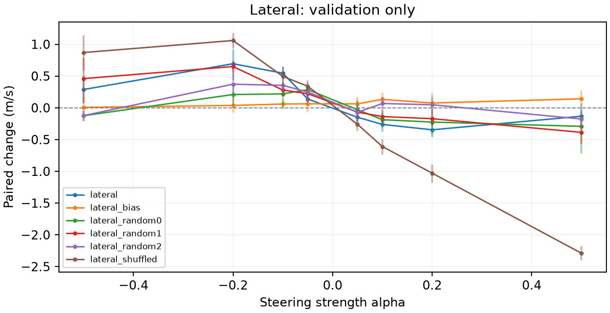
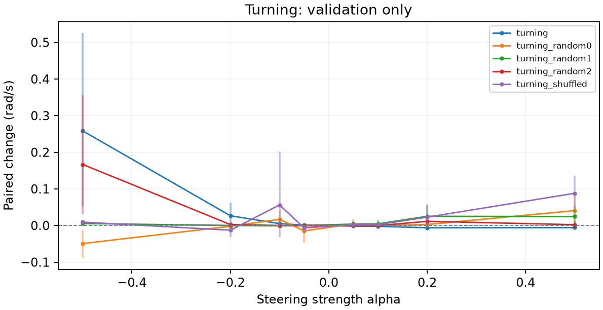

# RL locomotion steering: ant-classic-005

Report generated: 2026-09-08T00:22:59+00:00

## Outcome

Recorded run status: confirmation_failed.
All 88 validation conditions and six locked confirmation conditions are complete. The primary lateral vector at alpha -0.1 has a held-out effect of +0.40238 m/s, paired 95% interval [+0.30803, +0.49127], with lateral mean 0.17472 to 0.57710 m/s and 96.83% forward-speed retention. Failure counts are 4/30 in both arms; inversion increases 0.71685 percentage points and forbidden contact remains zero. Effect, locomotion, and all five-percentage-point quality-increase limits pass. The formal status remains confirmation_failed solely because an additional strict rule disqualifies any prefix-only episode: seed 520025 terminates identically at step 34 in both arms, before steering at step 100. All 30 pairs remain counted; that pair contributes zero behavioral difference. No threshold, selection, or exclusion changed after confirmation. No replication or application was run. Preliminary paired videos show the first three predetermined validation seeds and add no new evaluation evidence.
Validation selection: lateral (lateral), alpha=-0.1; lateral_bias (lateral), alpha=0.5; lateral_random0 (lateral), alpha=-0.05; lateral_random1 (lateral), alpha=-0.1; lateral_random2 (lateral), alpha=-0.05; lateral_shuffled (lateral), alpha=-0.2
A gate pass is a pilot usefulness decision for one condition; it does not establish generalization across training seeds.

## Question and method

Can adding a constant vector after the first actor ReLU change locomotion while preserving movement? The policy stays frozen. Vectors are episode-weighted differences of contrasting unsteered activations, normalized to centered activation RMS. The protocol includes random and shuffled-label controls on the same evaluation split when that stage is reached. No behavioral cloning is used.

## Interpretation

Delta is treated minus baseline in the behavior's units. Speed/lateral use m/s, height uses m, turning uses rad/s, and effort is mean squared normalized action, not physical energy. Confidence intervals resample paired episodes. Validation selects strengths; confirmation and replication provide fresh evidence when recorded. Useful effects require the target threshold, a confidence interval excluding zero, and locomotion/quality checks. Control effects must be considered before attributing specificity to the extracted direction.

## Fitting diagnostics

Fitting windows: episodes=64; total windows=531; eligible windows=531; eligible episodes=62; excluded nonfinite=0; excluded unhealthy=0; discarded tail steps=309; warmup=100; window=100; minimum speed fraction=0.5; minimum speed floor=3.1749; healthy median speed=6.3498; excluded slow windows=0; speed filter reason=project pilot heuristic: exclude finite healthy fitting windows at or below fraction times their median speed.
Centered activation RMS: 5.1513. Convention: episode-balanced eligible timestep RMS about episode-balanced mean; full 100-step windows after 100-step warmup.
lateral (m/s): status=fitted; high episodes=58; low episodes=57; high windows=133; low windows=133; contrast=0.98035; raw norm=0.48718; split-half cosine=0.96565.
turning (rad/s): status=fitted; high episodes=58; low episodes=56; high windows=133; low windows=133; contrast=0.090821; raw norm=0.18857; split-half cosine=0.76102.
Split-half cosine measures extraction agreement, not causal effectiveness. Full bin statistics and vector coordinates are retained in vector_diagnostics.json.

## Research decisions

2026-09-08T00:02:10.064096+00:00: Proceed after fitting review: lateral contrast is sustained and robust to fitting-only exclusions. Turning remains an exploratory heading-correction contrast; no sustained-turn concept is inferred. Keep both original registered candidates for causal validation. Evidence: 531 healthy running windows; lateral split-half cosine 0.9657, extended-window contrasts retained; turning adjacent-window correlation -0.505 and declining long-window contrast. See fitting-inspection report..
2026-09-08T00:02:10.064096+00:00: Explicit manifest migration adds strength_grid equal to the exact original hard-coded coarse grid, already preregistered before diagnostics. No prior validation exists; fitting trajectories/vectors unchanged. Evidence: Code 2377452 replaces the fixed tuple with a serialized equivalent default. Diagnostic and fitting collection used 8ad6ce3; future invocation code is logged..

## Validation

88 recorded intervention conditions.

| Vector / behavior | Alpha | Delta | 95% CI | Pairs | Useful |
| --- | --- | --- | --- | --- | --- |
| lateral / lateral | -0.5 | 0.28878 | [0.072823, 0.50156] | 10 | no |
| lateral / lateral | -0.2 | 0.69381 | [0.43568, 0.91306] | 10 | no |
| lateral / lateral | -0.1 | 0.54501 | [0.44638, 0.63939] | 10 | yes |
| lateral / lateral | -0.05 | 0.13831 | [0.053774, 0.2272] | 10 | no |
| lateral / lateral | 0.05 | -0.14848 | [-0.28125, -0.018899] | 10 | no |
| lateral / lateral | 0.1 | -0.26147 | [-0.37796, -0.13919] | 10 | yes |
| lateral / lateral | 0.2 | -0.34635 | [-0.463, -0.21657] | 10 | no |
| lateral / lateral | 0.5 | -0.1325 | [-0.21576, -0.060316] | 10 | no |
| lateral_random0 / lateral | -0.5 | -0.12426 | [-0.21147, -0.049505] | 10 | no |
| lateral_random0 / lateral | -0.2 | 0.20902 | [0.038158, 0.37238] | 10 | no |
| lateral_random0 / lateral | -0.1 | 0.21888 | [-0.0033447, 0.40874] | 10 | no |
| lateral_random0 / lateral | -0.05 | 0.28633 | [0.15805, 0.39429] | 10 | yes |
| lateral_random0 / lateral | 0.05 | -0.030022 | [-0.20875, 0.12187] | 10 | no |
| lateral_random0 / lateral | 0.1 | -0.18718 | [-0.31491, -0.048701] | 10 | no |
| lateral_random0 / lateral | 0.2 | -0.22429 | [-0.42274, -0.0059972] | 10 | no |
| lateral_random0 / lateral | 0.5 | -0.29225 | [-0.7177, 0.068945] | 10 | no |
| lateral_random1 / lateral | -0.5 | 0.45989 | [0.081101, 0.78666] | 10 | no |
| lateral_random1 / lateral | -0.2 | 0.64971 | [0.56569, 0.74172] | 10 | no |
| lateral_random1 / lateral | -0.1 | 0.2794 | [0.19632, 0.37225] | 10 | yes |
| lateral_random1 / lateral | -0.05 | 0.22264 | [0.094918, 0.35558] | 10 | yes |
| lateral_random1 / lateral | 0.05 | -0.068453 | [-0.17049, 0.025544] | 10 | no |
| lateral_random1 / lateral | 0.1 | -0.13776 | [-0.23596, -0.036368] | 10 | no |
| lateral_random1 / lateral | 0.2 | -0.17133 | [-0.28732, -0.059963] | 10 | no |
| lateral_random1 / lateral | 0.5 | -0.38691 | [-0.57397, -0.19639] | 10 | no |
| lateral_random2 / lateral | -0.5 | -0.1224 | [-0.21116, -0.045633] | 10 | no |
| lateral_random2 / lateral | -0.2 | 0.37174 | [0.13923, 0.5972] | 10 | no |
| lateral_random2 / lateral | -0.1 | 0.35293 | [0.22396, 0.47019] | 10 | no |
| lateral_random2 / lateral | -0.05 | 0.24878 | [0.11885, 0.3667] | 10 | yes |
| lateral_random2 / lateral | 0.05 | -0.070871 | [-0.20426, 0.050776] | 10 | no |
| lateral_random2 / lateral | 0.1 | 0.067581 | [-0.045964, 0.17681] | 10 | no |
| lateral_random2 / lateral | 0.2 | 0.047796 | [-0.075917, 0.17665] | 10 | no |
| lateral_random2 / lateral | 0.5 | -0.17689 | [-0.30959, -0.014575] | 10 | no |
| lateral_shuffled / lateral | -0.5 | 0.87 | [0.58356, 1.142] | 10 | no |
| lateral_shuffled / lateral | -0.2 | 1.0593 | [0.93082, 1.1738] | 10 | yes |
| lateral_shuffled / lateral | -0.1 | 0.49446 | [0.33537, 0.64667] | 10 | no |
| lateral_shuffled / lateral | -0.05 | 0.33943 | [0.24945, 0.43099] | 10 | yes |
| lateral_shuffled / lateral | 0.05 | -0.25989 | [-0.36041, -0.18028] | 10 | yes |
| lateral_shuffled / lateral | 0.1 | -0.61 | [-0.73344, -0.49411] | 10 | yes |
| lateral_shuffled / lateral | 0.2 | -1.0287 | [-1.1803, -0.89617] | 10 | yes |
| lateral_shuffled / lateral | 0.5 | -2.2897 | [-2.4041, -2.1762] | 10 | no |
| turning / turning | -0.5 | 0.25838 | [0.053016, 0.52581] | 10 | no |
| turning / turning | -0.2 | 0.026696 | [0.0042015, 0.06196] | 10 | no |
| turning / turning | -0.1 | 0.0051989 | [-0.0010361, 0.01333] | 10 | no |
| turning / turning | -0.05 | 0.0011721 | [-0.0032673, 0.005528] | 10 | no |
| turning / turning | 0.05 | -0.0016679 | [-0.00399, 0.00084382] | 10 | no |
| turning / turning | 0.1 | -0.0022496 | [-0.0038486, -0.00053519] | 10 | no |
| turning / turning | 0.2 | -0.0060875 | [-0.0091907, -0.0032028] | 10 | no |
| turning / turning | 0.5 | -0.0056885 | [-0.0083384, -0.0030519] | 10 | no |
| turning_random0 / turning | -0.5 | -0.04917 | [-0.088732, -0.011979] | 10 | no |
| turning_random0 / turning | -0.2 | -0.0020326 | [-0.019422, 0.0090671] | 10 | no |
| turning_random0 / turning | -0.1 | 0.017149 | [0.00080273, 0.039997] | 10 | no |
| turning_random0 / turning | -0.05 | -0.014727 | [-0.047539, 0.0025788] | 10 | no |
| turning_random0 / turning | 0.05 | 0.0045217 | [-0.0031297, 0.01785] | 10 | no |
| turning_random0 / turning | 0.1 | 0.00047628 | [-0.0030635, 0.0045589] | 10 | no |
| turning_random0 / turning | 0.2 | 0.0028422 | [-0.0012509, 0.0071605] | 10 | no |
| turning_random0 / turning | 0.5 | 0.040746 | [0.005907, 0.081709] | 10 | no |
| turning_random1 / turning | -0.5 | 0.0054529 | [0.0039294, 0.007041] | 10 | no |
| turning_random1 / turning | -0.2 | 0.0002151 | [-0.0032528, 0.0034688] | 10 | no |
| turning_random1 / turning | -0.1 | -0.00077791 | [-0.0028409, 0.0012031] | 10 | no |
| turning_random1 / turning | -0.05 | 0.00042728 | [-0.001621, 0.0024629] | 10 | no |
| turning_random1 / turning | 0.05 | 0.0038114 | [-0.00066819, 0.011238] | 10 | no |
| turning_random1 / turning | 0.1 | 0.0045926 | [-0.0026764, 0.01547] | 10 | no |
| turning_random1 / turning | 0.2 | 0.025265 | [0.0037282, 0.055551] | 10 | no |
| turning_random1 / turning | 0.5 | 0.024517 | [-0.0097931, 0.053437] | 10 | no |
| turning_random2 / turning | -0.5 | 0.16677 | [0.030592, 0.35585] | 10 | no |
| turning_random2 / turning | -0.2 | 0.0026685 | [-5.6629e-05, 0.0054377] | 10 | no |
| turning_random2 / turning | -0.1 | 0.00011594 | [-0.0014322, 0.0016677] | 10 | no |
| turning_random2 / turning | -0.05 | -0.00070912 | [-0.0017512, 0.00022468] | 10 | no |
| turning_random2 / turning | 0.05 | -4.5685e-05 | [-0.0017918, 0.0017469] | 10 | no |
| turning_random2 / turning | 0.1 | -0.00024426 | [-0.0023498, 0.0015852] | 10 | no |
| turning_random2 / turning | 0.2 | 0.011482 | [-0.00255, 0.027835] | 10 | no |
| turning_random2 / turning | 0.5 | 0.0022812 | [-0.0073867, 0.01161] | 10 | no |
| turning_shuffled / turning | -0.5 | 0.0093495 | [0.0071563, 0.011631] | 10 | no |
| turning_shuffled / turning | -0.2 | -0.012784 | [-0.031135, 0.007347] | 10 | no |
| turning_shuffled / turning | -0.1 | 0.056214 | [-0.030858, 0.20237] | 10 | no |
| turning_shuffled / turning | -0.05 | -0.0066937 | [-0.018378, 0.00025369] | 10 | no |
| turning_shuffled / turning | 0.05 | 0.0029126 | [-2.5389e-05, 0.0059004] | 10 | no |
| turning_shuffled / turning | 0.1 | 0.0024215 | [-0.0012007, 0.0049435] | 10 | no |
| turning_shuffled / turning | 0.2 | 0.022837 | [0.0028508, 0.056974] | 10 | no |
| turning_shuffled / turning | 0.5 | 0.088057 | [0.045224, 0.13614] | 10 | no |
| lateral_bias / lateral | -0.5 | 0.0068986 | [-0.16561, 0.17812] | 10 | no |
| lateral_bias / lateral | -0.2 | 0.0371 | [-0.070516, 0.14375] | 10 | no |
| lateral_bias / lateral | -0.1 | 0.05957 | [-0.015056, 0.12835] | 10 | no |
| lateral_bias / lateral | -0.05 | 0.062666 | [-0.065389, 0.19068] | 10 | no |
| lateral_bias / lateral | 0.05 | 0.062543 | [-0.049551, 0.17015] | 10 | no |
| lateral_bias / lateral | 0.1 | 0.13253 | [0.020253, 0.23759] | 10 | no |
| lateral_bias / lateral | 0.2 | 0.075058 | [-0.07468, 0.23452] | 10 | no |
| lateral_bias / lateral | 0.5 | 0.14187 | [0.019272, 0.26802] | 10 | no |

## Confirmation

6 recorded intervention conditions.

| Vector / behavior | Alpha | Delta | 95% CI | Pairs | Useful |
| --- | --- | --- | --- | --- | --- |
| lateral / lateral | -0.1 | 0.40238 | [0.30803, 0.49127] | 30 | no |
| lateral_bias / lateral | 0.5 | 0.13439 | [0.075858, 0.19724] | 30 | no |
| lateral_random0 / lateral | -0.05 | 0.1555 | [0.094923, 0.21724] | 30 | no |
| lateral_random1 / lateral | -0.1 | 0.25282 | [0.19463, 0.31103] | 30 | no |
| lateral_random2 / lateral | -0.05 | 0.15472 | [0.089197, 0.21874] | 30 | no |
| lateral_shuffled / lateral | -0.2 | 0.89039 | [0.77057, 0.97974] | 30 | no |

## Unmeasured stages

No recorded measurements: replication. No causal steering outcome is inferred for these stages.

## Reproduction and provenance

Created: 2026-09-07T23:55:37.168964+00:00; code commit: 8ad6ce3.
Policy: farama-minari/Ant-v5-SAC-medium; algorithm: SAC; environment: Ant-v5.
Checkpoint revision: de5978d34b0118341df2b0a30232c5d2bfcb148e. SHA256: dea0e6dbb847776ac9e91dc8b7df5ba975742924eb55831d2da08a0abc786ca2.
Layer: actor.latent_pi.1; hidden dimension: 256; observation/action shapes: [105] / [8].
Seed partitions below are registered assignments, not completion counts.
Diagnostic: 16 seeds; range 500000-500015.
Fit: 64 seeds; range 501000-501063.
Validation: 10 seeds; range 510000-510009.
Confirmation: 30 seeds; range 520000-520029.
Replication: 30 seeds; range 530000-530029.
Configuration: torch_threads=1; rollout_workers=4; max_steps=1000; warmup=100; diagnostic_episodes=16; fit_episodes=64; validation_episodes=10; confirmation_episodes=30; replication_episodes=30; seed_offset=5e+05; fit_min_speed_fraction=0.5; strength_grid=-0.5,-0.2,-0.1,-0.05,0.05,0.1,0.2,0.5.
Software: numpy 1.26.4; torch 2.5.1+cpu; torchvision 0.20.1+cpu; stable-baselines3 2.4.1; sb3-contrib 2.4.0; gymnasium 1.0.0; mujoco 3.1.5; baukit 0.0.1.
Full exact seed lists, checkpoint metadata and the original specification remain in adjacent manifest.json. Full measured analysis is in results.json; extraction details are in vector_diagnostics.json. The report does not change these artifacts or rerun inference.

## Sources

CAA method: https://arxiv.org/abs/2312.06681
Baukit hooks: https://github.com/davidbau/baukit/blob/9d51abd51ebf29769aecc38c4cbef459b731a36e/baukit/nethook.py
Environment and measurement references: docs/sources.md in the repository.
Reporting: https://docs.reportlab.com/reportlab/userguide/ and https://matplotlib.org/stable/users/index.html

Full artifacts: [manifest](manifest.json), [results](results.json), [extraction diagnostics](vector_diagnostics.json).

## Validation strength response

