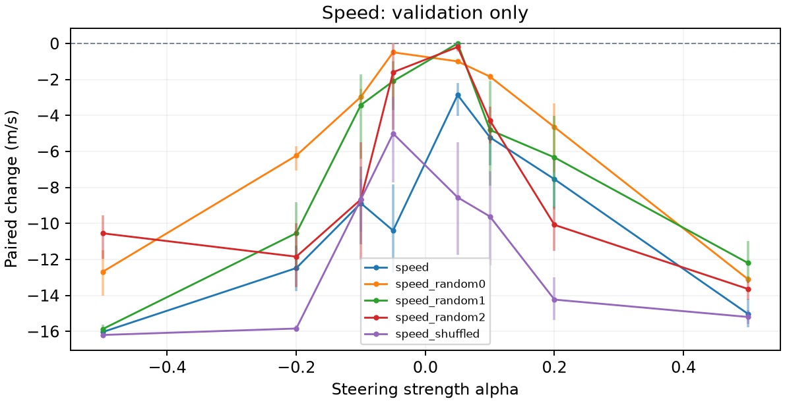

# RL locomotion steering: hc-height-speed-003

Report generated: 2026-09-07T23:59:10+00:00

## Outcome

Recorded run status: no_validation_candidate.
The exact height-derived vector and all four controls from hc-running-002 were imported unchanged and relabeled speed for this new target; no diagnostic or fitting episodes were recollected. All eight primary strengths failed physical quality across 40 fresh validation conditions. At alpha=+0.05, speed fell from 16.80795 to 13.94952 m/s (-17.01%; paired effect -2.85844 m/s, 95% CI [-4.02963, -2.19343]), but two of ten episodes physically failed despite pooled contact of 3.556%. Two settings of source height_random0 passed validation gates; neither was selected or confirmed. No selection, confirmation, replication, action-bias comparison, or application was performed. Experiment 004 will test smaller signed strengths on fresh data. Original fitting evidence and labels are retained in the inherited diagnostics and retarget.json.
Validation selection: No selected intervention was recorded.
A gate pass is a pilot usefulness decision for one condition; it does not establish generalization across training seeds.

## Question and method

Can adding a constant vector after the first actor ReLU change locomotion while preserving movement? The policy stays frozen. Vectors are episode-weighted differences of contrasting unsteered activations, normalized to centered activation RMS. The protocol includes random and shuffled-label controls on the same evaluation split when that stage is reached. No behavioral cloning is used.

## Interpretation

Delta is treated minus baseline in the behavior's units. Speed/lateral use m/s, height uses m, turning uses rad/s, and effort is mean squared normalized action, not physical energy. Confidence intervals resample paired episodes. Validation selects strengths; confirmation and replication provide fresh evidence when recorded. Useful effects require the target threshold, a confidence interval excluding zero, and locomotion/quality checks. Control effects must be considered before attributing specificity to the extracted direction.

## Fitting diagnostics

Inherited fitting diagnostics from runs\hc-running-002; source vector height is evaluated as speed. No new fitting episodes were collected. The source statistics below retain their original labels.
Fitting windows: episodes=64; total windows=576; eligible windows=564; eligible episodes=64; excluded nonfinite=0; excluded unhealthy=12; discarded tail steps=0; warmup=100; window=100; minimum speed fraction=0.5; minimum speed floor=7.327; healthy median speed=14.654; excluded slow windows=0; speed filter reason=project pilot heuristic: exclude finite healthy fitting windows at or below fraction times their median speed.
Centered activation RMS: 8.705. Convention: episode-balanced eligible timestep RMS about episode-balanced mean; full 100-step windows after 100-step warmup.
effort (mean squared action): status=fitted; high episodes=60; low episodes=57; high windows=144; low windows=144; contrast=0.031536; raw norm=0.43919; split-half cosine=0.89514.
height (m): status=fitted; high episodes=61; low episodes=61; high windows=141; low windows=141; contrast=0.044745; raw norm=1.2007; split-half cosine=0.97976.
speed (m/s): status=fitted; high episodes=61; low episodes=59; high windows=141; low windows=141; contrast=2.3066; raw norm=1.021; split-half cosine=0.98237.
Split-half cosine measures extraction agreement, not causal effectiveness. Full bin statistics and vector coordinates are retained in vector_diagnostics.json.

## Research decisions

2026-09-07T23:41:44.370823+00:00: Test whether the unchanged height-contrast vector from runs\hc-running-002 provides useful speed control. Recalibrate its complete control family on fresh validation episodes, then freeze selection before confirmation. Evidence: Parent validation suggested a cross-behavior effect. This is an explicitly adaptive exploratory follow-up; it does not identify an internal semantic concept..

## Validation

40 recorded intervention conditions.

| Vector / behavior | Alpha | Delta | 95% CI | Pairs | Useful |
| --- | --- | --- | --- | --- | --- |
| speed / speed | -0.5 | -16.031 | [-16.14, -15.898] | 10 | no |
| speed / speed | -0.2 | -12.478 | [-13.76, -11.241] | 10 | no |
| speed / speed | -0.1 | -8.8735 | [-11.165, -6.851] | 10 | no |
| speed / speed | -0.05 | -10.393 | [-12.743, -7.8175] | 10 | no |
| speed / speed | 0.05 | -2.8584 | [-4.0296, -2.1934] | 10 | no |
| speed / speed | 0.1 | -5.2138 | [-6.7695, -4.3075] | 10 | no |
| speed / speed | 0.2 | -7.5415 | [-9.0969, -6.3792] | 10 | no |
| speed / speed | 0.5 | -15.025 | [-15.777, -14.196] | 10 | no |
| speed_random0 / speed | -0.5 | -12.685 | [-14.019, -11.475] | 10 | no |
| speed_random0 / speed | -0.2 | -6.2295 | [-7.0493, -5.7162] | 10 | no |
| speed_random0 / speed | -0.1 | -2.9679 | [-3.4128, -2.5157] | 10 | no |
| speed_random0 / speed | -0.05 | -0.49128 | [-0.61998, -0.35583] | 10 | no |
| speed_random0 / speed | 0.05 | -0.99323 | [-1.0933, -0.90097] | 10 | yes |
| speed_random0 / speed | 0.1 | -1.8374 | [-2.0488, -1.6693] | 10 | yes |
| speed_random0 / speed | 0.2 | -4.6469 | [-7.1521, -3.3334] | 10 | no |
| speed_random0 / speed | 0.5 | -13.1 | [-13.306, -12.904] | 10 | no |
| speed_random1 / speed | -0.5 | -15.868 | [-16.104, -15.604] | 10 | no |
| speed_random1 / speed | -0.2 | -10.536 | [-12.355, -8.8189] | 10 | no |
| speed_random1 / speed | -0.1 | -3.4208 | [-6.3842, -1.7227] | 10 | no |
| speed_random1 / speed | -0.05 | -2.0959 | [-3.6829, -0.98302] | 10 | no |
| speed_random1 / speed | 0.05 | 0.0051884 | [0.00011034, 0.010158] | 10 | no |
| speed_random1 / speed | 0.1 | -4.8043 | [-7.8884, -2.0995] | 10 | no |
| speed_random1 / speed | 0.2 | -6.3301 | [-9.2052, -4.0342] | 10 | no |
| speed_random1 / speed | 0.5 | -12.198 | [-13.273, -10.985] | 10 | no |
| speed_random2 / speed | -0.5 | -10.547 | [-11.979, -9.5643] | 10 | no |
| speed_random2 / speed | -0.2 | -11.844 | [-13.54, -9.9974] | 10 | no |
| speed_random2 / speed | -0.1 | -8.6661 | [-12.006, -5.4902] | 10 | no |
| speed_random2 / speed | -0.05 | -1.5952 | [-4.7813, 0.038445] | 10 | no |
| speed_random2 / speed | 0.05 | -0.19512 | [-0.42522, -0.054478] | 10 | no |
| speed_random2 / speed | 0.1 | -4.2744 | [-5.5635, -3.5035] | 10 | no |
| speed_random2 / speed | 0.2 | -10.077 | [-11.526, -9.0772] | 10 | no |
| speed_random2 / speed | 0.5 | -13.639 | [-14.242, -13.233] | 10 | no |
| speed_shuffled / speed | -0.5 | -16.195 | [-16.22, -16.173] | 10 | no |
| speed_shuffled / speed | -0.2 | -15.837 | [-16.015, -15.644] | 10 | no |
| speed_shuffled / speed | -0.1 | -8.6672 | [-10.459, -7.5327] | 10 | no |
| speed_shuffled / speed | -0.05 | -5.0032 | [-7.7024, -2.966] | 10 | no |
| speed_shuffled / speed | 0.05 | -8.5493 | [-11.748, -5.4893] | 10 | no |
| speed_shuffled / speed | 0.1 | -9.6108 | [-12.334, -7.1003] | 10 | no |
| speed_shuffled / speed | 0.2 | -14.23 | [-15.36, -12.976] | 10 | no |
| speed_shuffled / speed | 0.5 | -15.195 | [-15.582, -14.831] | 10 | no |

## Unmeasured stages

No recorded measurements: confirmation, replication. No causal steering outcome is inferred for these stages.

## Reproduction and provenance

Created: 2026-09-07T23:41:44.330319+00:00; code commit: 6600176.
Policy: farama-minari/HalfCheetah-v5-TQC-medium; algorithm: TQC; environment: HalfCheetah-v5.
Checkpoint revision: b4ce04da6f246f06ae4c4258b8ab39624e6600b4. SHA256: 8231919095d5a35a2b799e865e968feca535d5af3f40a4b092947c70a976b7e1.
Layer: actor.latent_pi.1; hidden dimension: 256; observation/action shapes: [17] / [6].
Seed partitions below are registered assignments, not completion counts.
Diagnostic: 16 seeds; range 100000-100015.
Fit: 64 seeds; range 101000-101063.
Validation: 10 seeds; range 210000-210009.
Confirmation: 30 seeds; range 220000-220029.
Replication: 30 seeds; range 230000-230029.
Configuration: torch_threads=1; rollout_workers=4; max_steps=1000; warmup=100; diagnostic_episodes=16; fit_episodes=64; validation_episodes=10; confirmation_episodes=30; replication_episodes=30; seed_offset=2e+05; fit_min_speed_fraction=0.5.
Software: numpy 1.26.4; torch 2.5.1+cpu; torchvision 0.20.1+cpu; stable-baselines3 2.4.1; sb3-contrib 2.4.0; gymnasium 1.0.0; mujoco 3.1.5; baukit 0.0.1.
Full exact seed lists, checkpoint metadata and the original specification remain in adjacent manifest.json. Full measured analysis is in results.json; extraction details are in vector_diagnostics.json. The report does not change these artifacts or rerun inference.

## Sources

CAA method: https://arxiv.org/abs/2312.06681
Baukit hooks: https://github.com/davidbau/baukit/blob/9d51abd51ebf29769aecc38c4cbef459b731a36e/baukit/nethook.py
Environment and measurement references: docs/sources.md in the repository.
Reporting: https://docs.reportlab.com/reportlab/userguide/ and https://matplotlib.org/stable/users/index.html

Full artifacts: [manifest](manifest.json), [results](results.json), [extraction diagnostics](vector_diagnostics.json).

## Validation strength response

