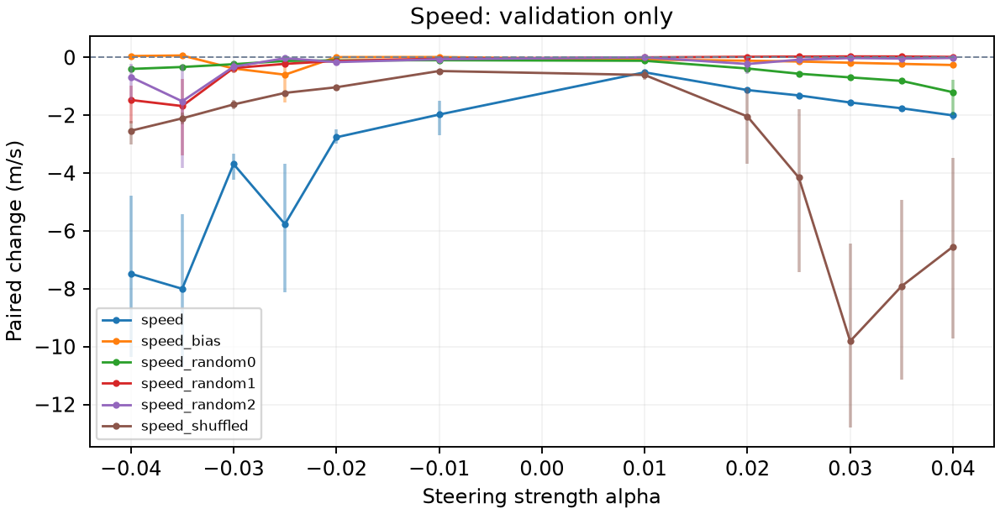

# RL locomotion steering: hc-height-speed-004

Report generated: 2026-09-08T00:07:11+00:00

## Outcome

Recorded run status: confirmation_failed.
The exact height-derived family from hc-running-002 was tested for speed control on a finer signed grid, without refitting or training. Six of twelve primary settings passed validation; the locked choice alpha=-0.02 had the largest eligible slowdown. On thirty fresh confirmation episodes it slowed speed from 16.80155 to 11.44279 m/s (-31.89%; paired effect -5.35876 m/s, 95% CI [-6.98568, -3.99911]) but physically failed in ten episodes (33.33%), so confirmation failed. All 72 validation and six confirmation conditions are retained. Two controls passed confirmation pilot gates, including a shuffled direction with one physical failure within the predeclared allowance; neither control was replicated. No replication or application episodes were collected. The selected strength was not replaced after confirmation.
Validation selection: speed (speed), alpha=-0.02; speed_bias (speed), alpha=-0.025; speed_random0 (speed), alpha=0.04; speed_random1 (speed), alpha=-0.035; speed_random2 (speed), alpha=-0.035; speed_shuffled (speed), alpha=-0.035
A gate pass is a pilot usefulness decision for one condition; it does not establish generalization across training seeds.

## Question and method

Can adding a constant vector after the first actor ReLU change locomotion while preserving movement? The policy stays frozen. Vectors are episode-weighted differences of contrasting unsteered activations, normalized to centered activation RMS. The protocol includes random and shuffled-label controls on the same evaluation split when that stage is reached. No behavioral cloning is used.

## Interpretation

Delta is treated minus baseline in the behavior's units. Speed/lateral use m/s, height uses m, turning uses rad/s, and effort is mean squared normalized action, not physical energy. Confidence intervals resample paired episodes. Validation selects strengths; confirmation and replication provide fresh evidence when recorded. Useful effects require the target threshold, a confidence interval excluding zero, and locomotion/quality checks. Control effects must be considered before attributing specificity to the extracted direction.

## Fitting diagnostics

Inherited fitting diagnostics from runs\hc-running-002; source vector height is evaluated as speed. No new fitting episodes were collected. The source statistics below retain their original labels.
Fitting windows: episodes=64; total windows=576; eligible windows=564; eligible episodes=64; excluded nonfinite=0; excluded unhealthy=12; discarded tail steps=0; warmup=100; window=100; minimum speed fraction=0.5; minimum speed floor=7.327; healthy median speed=14.654; excluded slow windows=0; speed filter reason=project pilot heuristic: exclude finite healthy fitting windows at or below fraction times their median speed.
Centered activation RMS: 8.705. Convention: episode-balanced eligible timestep RMS about episode-balanced mean; full 100-step windows after 100-step warmup.
effort (mean squared action): status=fitted; high episodes=60; low episodes=57; high windows=144; low windows=144; contrast=0.031536; raw norm=0.43919; split-half cosine=0.89514.
height (m): status=fitted; high episodes=61; low episodes=61; high windows=141; low windows=141; contrast=0.044745; raw norm=1.2007; split-half cosine=0.97976.
speed (m/s): status=fitted; high episodes=61; low episodes=59; high windows=141; low windows=141; contrast=2.3066; raw norm=1.021; split-half cosine=0.98237.
Split-half cosine measures extraction agreement, not causal effectiveness. Full bin statistics and vector coordinates are retained in vector_diagnostics.json.

## Research decisions

2026-09-07T23:58:41.398747+00:00: Test whether the unchanged height-contrast vector from runs\hc-running-002 provides useful speed control. Recalibrate its complete control family on fresh validation episodes, then freeze selection before confirmation. Evidence: Parent validation suggested a cross-behavior effect. This is an explicitly adaptive exploratory follow-up; it does not identify an internal semantic concept..

## Validation

72 recorded intervention conditions.

| Vector / behavior | Alpha | Delta | 95% CI | Pairs | Useful |
| --- | --- | --- | --- | --- | --- |
| speed / speed | -0.04 | -7.4797 | [-10.357, -4.7672] | 10 | no |
| speed / speed | -0.035 | -8.0016 | [-10.706, -5.418] | 10 | no |
| speed / speed | -0.03 | -3.6865 | [-4.2169, -3.3239] | 10 | no |
| speed / speed | -0.025 | -5.7659 | [-8.1115, -3.6734] | 10 | no |
| speed / speed | -0.02 | -2.7618 | [-2.9754, -2.4958] | 10 | yes |
| speed / speed | -0.01 | -1.9757 | [-2.681, -1.5042] | 10 | no |
| speed / speed | 0.01 | -0.51444 | [-0.61165, -0.44272] | 10 | no |
| speed / speed | 0.02 | -1.128 | [-1.2014, -1.0632] | 10 | yes |
| speed / speed | 0.025 | -1.3134 | [-1.4185, -1.2223] | 10 | yes |
| speed / speed | 0.03 | -1.5581 | [-1.6441, -1.4784] | 10 | yes |
| speed / speed | 0.035 | -1.7577 | [-1.8372, -1.6885] | 10 | yes |
| speed / speed | 0.04 | -2.0042 | [-2.173, -1.8695] | 10 | yes |
| speed_random0 / speed | -0.04 | -0.39776 | [-0.50032, -0.30182] | 10 | no |
| speed_random0 / speed | -0.035 | -0.33028 | [-0.40842, -0.25486] | 10 | no |
| speed_random0 / speed | -0.03 | -0.23395 | [-0.3126, -0.16407] | 10 | no |
| speed_random0 / speed | -0.025 | -0.12049 | [-0.13308, -0.10998] | 10 | no |
| speed_random0 / speed | -0.02 | -0.10242 | [-0.10515, -0.098471] | 10 | no |
| speed_random0 / speed | -0.01 | -0.096225 | [-0.10483, -0.087207] | 10 | no |
| speed_random0 / speed | 0.01 | -0.11471 | [-0.18705, -0.05017] | 10 | no |
| speed_random0 / speed | 0.02 | -0.38219 | [-0.42353, -0.34287] | 10 | no |
| speed_random0 / speed | 0.025 | -0.5627 | [-0.61675, -0.51031] | 10 | no |
| speed_random0 / speed | 0.03 | -0.69011 | [-0.74616, -0.63852] | 10 | no |
| speed_random0 / speed | 0.035 | -0.81081 | [-0.87936, -0.75068] | 10 | no |
| speed_random0 / speed | 0.04 | -1.2025 | [-1.9955, -0.7751] | 10 | no |
| speed_random1 / speed | -0.04 | -1.4713 | [-2.2733, -0.96726] | 10 | no |
| speed_random1 / speed | -0.035 | -1.6807 | [-3.3753, -0.74555] | 10 | no |
| speed_random1 / speed | -0.03 | -0.36577 | [-0.47083, -0.26464] | 10 | no |
| speed_random1 / speed | -0.025 | -0.222 | [-0.32525, -0.14824] | 10 | no |
| speed_random1 / speed | -0.02 | -0.12163 | [-0.14629, -0.093287] | 10 | no |
| speed_random1 / speed | -0.01 | -0.0431 | [-0.057729, -0.031301] | 10 | no |
| speed_random1 / speed | 0.01 | 0.0029704 | [-0.0024723, 0.0082149] | 10 | no |
| speed_random1 / speed | 0.02 | 0.02272 | [0.018168, 0.027824] | 10 | no |
| speed_random1 / speed | 0.025 | 0.029461 | [0.023554, 0.035611] | 10 | no |
| speed_random1 / speed | 0.03 | 0.035312 | [0.029835, 0.041088] | 10 | no |
| speed_random1 / speed | 0.035 | 0.032951 | [0.026911, 0.038998] | 10 | no |
| speed_random1 / speed | 0.04 | 0.018667 | [0.012031, 0.025362] | 10 | no |
| speed_random2 / speed | -0.04 | -0.67658 | [-1.4594, -0.21129] | 10 | no |
| speed_random2 / speed | -0.035 | -1.5165 | [-3.8325, -0.25186] | 10 | no |
| speed_random2 / speed | -0.03 | -0.32184 | [-0.54758, -0.13681] | 10 | no |
| speed_random2 / speed | -0.025 | -0.026994 | [-0.060267, 0.0019618] | 10 | no |
| speed_random2 / speed | -0.02 | -0.16029 | [-0.22085, -0.1091] | 10 | no |
| speed_random2 / speed | -0.01 | -0.06245 | [-0.10678, -0.029006] | 10 | no |
| speed_random2 / speed | 0.01 | 0.0049307 | [-0.0069636, 0.015473] | 10 | no |
| speed_random2 / speed | 0.02 | -0.22658 | [-0.57698, -0.03101] | 10 | no |
| speed_random2 / speed | 0.025 | -0.078226 | [-0.14479, -0.023982] | 10 | no |
| speed_random2 / speed | 0.03 | -0.021559 | [-0.029636, -0.01371] | 10 | no |
| speed_random2 / speed | 0.035 | -0.037576 | [-0.065754, -0.012835] | 10 | no |
| speed_random2 / speed | 0.04 | -0.017796 | [-0.030001, -0.0087582] | 10 | no |
| speed_shuffled / speed | -0.04 | -2.5354 | [-3.0131, -2.1877] | 10 | no |
| speed_shuffled / speed | -0.035 | -2.1063 | [-2.3152, -1.9049] | 10 | yes |
| speed_shuffled / speed | -0.03 | -1.6254 | [-1.8032, -1.4716] | 10 | yes |
| speed_shuffled / speed | -0.025 | -1.2259 | [-1.3098, -1.1531] | 10 | yes |
| speed_shuffled / speed | -0.02 | -1.0313 | [-1.1614, -0.94414] | 10 | yes |
| speed_shuffled / speed | -0.01 | -0.46926 | [-0.54605, -0.40082] | 10 | no |
| speed_shuffled / speed | 0.01 | -0.60532 | [-0.77018, -0.43862] | 10 | no |
| speed_shuffled / speed | 0.02 | -2.0407 | [-3.6859, -1.0647] | 10 | no |
| speed_shuffled / speed | 0.025 | -4.1548 | [-7.4316, -1.7853] | 10 | no |
| speed_shuffled / speed | 0.03 | -9.814 | [-12.809, -6.4459] | 10 | no |
| speed_shuffled / speed | 0.035 | -7.9126 | [-11.153, -4.9343] | 10 | no |
| speed_shuffled / speed | 0.04 | -6.5451 | [-9.7185, -3.4643] | 10 | no |
| speed_bias / speed | -0.04 | 0.048573 | [-0.021633, 0.098707] | 10 | no |
| speed_bias / speed | -0.035 | 0.067946 | [0.044758, 0.08764] | 10 | no |
| speed_bias / speed | -0.03 | -0.3816 | [-0.52577, -0.23823] | 10 | no |
| speed_bias / speed | -0.025 | -0.59631 | [-1.5459, -0.071972] | 10 | no |
| speed_bias / speed | -0.02 | 0.010885 | [-0.036184, 0.044599] | 10 | no |
| speed_bias / speed | -0.01 | 0.014225 | [-0.024591, 0.037364] | 10 | no |
| speed_bias / speed | 0.01 | -0.074037 | [-0.10232, -0.050679] | 10 | no |
| speed_bias / speed | 0.02 | -0.11299 | [-0.16114, -0.081494] | 10 | no |
| speed_bias / speed | 0.025 | -0.13998 | [-0.15784, -0.12343] | 10 | no |
| speed_bias / speed | 0.03 | -0.1828 | [-0.20696, -0.16462] | 10 | no |
| speed_bias / speed | 0.035 | -0.22313 | [-0.2941, -0.16987] | 10 | no |
| speed_bias / speed | 0.04 | -0.26185 | [-0.32872, -0.20332] | 10 | no |

## Confirmation

6 recorded intervention conditions.

| Vector / behavior | Alpha | Delta | 95% CI | Pairs | Useful |
| --- | --- | --- | --- | --- | --- |
| speed / speed | -0.02 | -5.3588 | [-6.9857, -3.9991] | 30 | no |
| speed_bias / speed | -0.025 | -0.11285 | [-0.16153, -0.063808] | 30 | no |
| speed_random0 / speed | 0.04 | -0.81328 | [-0.87674, -0.76671] | 30 | no |
| speed_random1 / speed | -0.035 | -0.85519 | [-0.96866, -0.76348] | 30 | yes |
| speed_random2 / speed | -0.035 | -0.55205 | [-0.97725, -0.31906] | 30 | no |
| speed_shuffled / speed | -0.035 | -2.3381 | [-3.1976, -1.8624] | 30 | yes |

## Unmeasured stages

No recorded measurements: replication. No causal steering outcome is inferred for these stages.

## Reproduction and provenance

Created: 2026-09-07T23:58:41.364452+00:00; code commit: 2377452.
Policy: farama-minari/HalfCheetah-v5-TQC-medium; algorithm: TQC; environment: HalfCheetah-v5.
Checkpoint revision: b4ce04da6f246f06ae4c4258b8ab39624e6600b4. SHA256: 8231919095d5a35a2b799e865e968feca535d5af3f40a4b092947c70a976b7e1.
Layer: actor.latent_pi.1; hidden dimension: 256; observation/action shapes: [17] / [6].
Seed partitions below are registered assignments, not completion counts.
Diagnostic: 16 seeds; range 100000-100015.
Fit: 64 seeds; range 101000-101063.
Validation: 10 seeds; range 310000-310009.
Confirmation: 30 seeds; range 320000-320029.
Replication: 30 seeds; range 330000-330029.
Configuration: torch_threads=1; rollout_workers=4; max_steps=1000; warmup=100; diagnostic_episodes=16; fit_episodes=64; validation_episodes=10; confirmation_episodes=30; replication_episodes=30; seed_offset=3e+05; fit_min_speed_fraction=0.5; strength_grid=-0.04,-0.035,-0.03,-0.025,-0.02,-0.01,0.01,0.02,0.025,0.03,0.035,0.04.
Software: numpy 1.26.4; torch 2.5.1+cpu; torchvision 0.20.1+cpu; stable-baselines3 2.4.1; sb3-contrib 2.4.0; gymnasium 1.0.0; mujoco 3.1.5; baukit 0.0.1.
Full exact seed lists, checkpoint metadata and the original specification remain in adjacent manifest.json. Full measured analysis is in results.json; extraction details are in vector_diagnostics.json. The report does not change these artifacts or rerun inference.

## Sources

CAA method: https://arxiv.org/abs/2312.06681
Baukit hooks: https://github.com/davidbau/baukit/blob/9d51abd51ebf29769aecc38c4cbef459b731a36e/baukit/nethook.py
Environment and measurement references: docs/sources.md in the repository.
Reporting: https://docs.reportlab.com/reportlab/userguide/ and https://matplotlib.org/stable/users/index.html

Full artifacts: [manifest](manifest.json), [results](results.json), [extraction diagnostics](vector_diagnostics.json).

## Validation strength response

