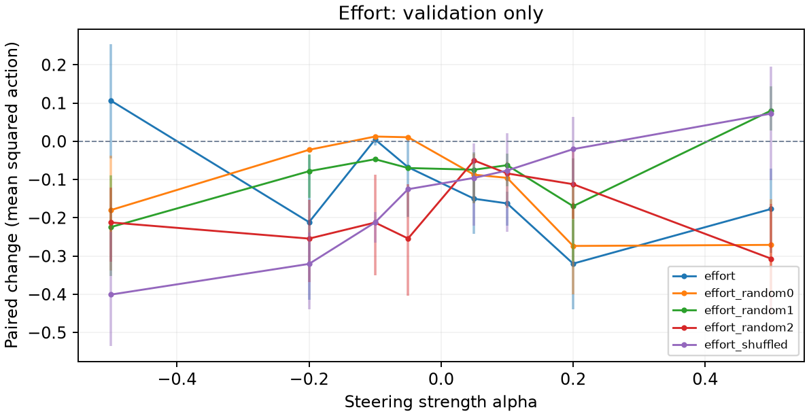
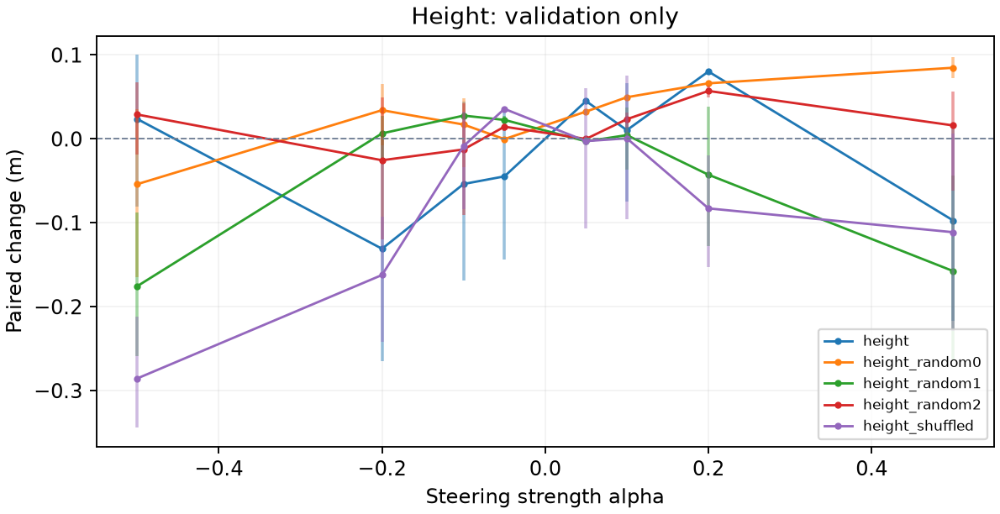
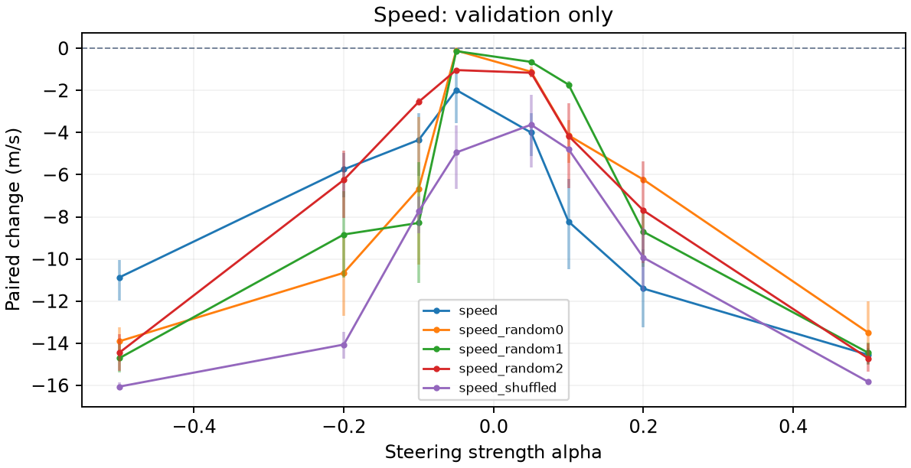

# RL locomotion steering: hc-running-002

Report generated: 2026-09-07T23:32:22+00:00

## Outcome

Recorded run status: no_validation_candidate.
All 24 primary-vector strength settings failed at least one usefulness gate across 120 validation conditions under the revised episode-level physical-failure criterion. The height vector at alpha=+0.05 raised torso height by 4.5048 cm (95% paired-episode CI 4.3673-4.6452 cm), with zero observed physical failures, contact or inversion, but reduced speed from 16.7955 to 14.6371 m/s (-12.85%), exceeding the predeclared 10% speed-preservation allowance. This is a causal posture effect on exploratory validation, not a useful confirmed intervention. Eight control settings passed validation gates; they are unconfirmed and do not establish specificity of contrastive extraction. No selection, confirmation or replication was performed. A fresh experiment will test the exact height-derived direction for useful speed control, with new validation and held-out episodes; the fitting label need not equal the useful outcome.
Validation selection: No selected intervention was recorded.
A gate pass is a pilot usefulness decision for one condition; it does not establish generalization across training seeds.

## Question and method

Can adding a constant vector after the first actor ReLU change locomotion while preserving movement? The policy stays frozen. Vectors are episode-weighted differences of contrasting unsteered activations, normalized to centered activation RMS. The protocol includes random and shuffled-label controls on the same evaluation split when that stage is reached. No behavioral cloning is used.

## Interpretation

Delta is treated minus baseline in the behavior's units. Speed/lateral use m/s, height uses m, turning uses rad/s, and effort is mean squared normalized action, not physical energy. Confidence intervals resample paired episodes. Validation selects strengths; confirmation and replication provide fresh evidence when recorded. Useful effects require the target threshold, a confidence interval excluding zero, and locomotion/quality checks. Control effects must be considered before attributing specificity to the extracted direction.

## Fitting diagnostics

Fitting windows: episodes=64; total windows=576; eligible windows=564; eligible episodes=64; excluded nonfinite=0; excluded unhealthy=12; discarded tail steps=0; warmup=100; window=100; minimum speed fraction=0.5; minimum speed floor=7.327; healthy median speed=14.654; excluded slow windows=0; speed filter reason=project pilot heuristic: exclude finite healthy fitting windows at or below fraction times their median speed.
Centered activation RMS: 8.705. Convention: episode-balanced eligible timestep RMS about episode-balanced mean; full 100-step windows after 100-step warmup.
effort (mean squared action): status=fitted; high episodes=60; low episodes=57; high windows=144; low windows=144; contrast=0.031536; raw norm=0.43919; split-half cosine=0.89514.
height (m): status=fitted; high episodes=61; low episodes=61; high windows=141; low windows=141; contrast=0.044745; raw norm=1.2007; split-half cosine=0.97976.
speed (m/s): status=fitted; high episodes=61; low episodes=59; high windows=141; low windows=141; contrast=2.3066; raw norm=1.021; split-half cosine=0.98237.
Split-half cosine measures extraction agreement, not causal effectiveness. Full bin statistics and vector coordinates are retained in vector_diagnostics.json.

## Research decisions

2026-09-07T23:05:48.788589+00:00: Removing near-stationary recovery windows prevents unwrapped rotation history from dominating the differences. A fitting-only half-median forward-speed floor should retain broad independent running contrasts. Evidence: reports/hc-classic-001-diagnostics.md; https://github.com/Farama-Foundation/Gymnasium/blob/v1.0.0/gymnasium/envs/mujoco/half_cheetah_v5.py.
2026-09-07T23:10:28.010858+00:00: Adopt inference-only buffer_size=1 loader override and audited cache migration before calibration. Evidence: inference-memory-audit.json: unchanged policy hash and byte-for-byte equality of every saved array for diagnostic seed 100000 and fitting seeds 101000 and 101010. Replay array allocation reduced from 308000000 to 1540 bytes..
2026-09-07T23:19:14.777484+00:00: Correct physical episode failure before selection or confirmation: an episode fails if its post-onset inversion or forbidden-contact fraction exceeds 5%, in addition to termination/prefix failure. Preserve pooled fractions and retain the existing maximum five-percentage-point increase in failure. Recompute all cached validation effects under this derived-analysis correction. Evidence: reports/hc-running-002-validation-inspection.md: one of ten episodes stalls on its head for400steps while pooled contact appears4.47%. The old74condition estimates remain in validation_pooled-quality-v1.json. No selection or confirmation exists..

## Validation

120 recorded intervention conditions.

| Vector / behavior | Alpha | Delta | 95% CI | Pairs | Useful |
| --- | --- | --- | --- | --- | --- |
| speed / speed | -0.5 | -10.88 | [-11.968, -10.035] | 10 | no |
| speed / speed | -0.2 | -5.747 | [-7.0605, -4.9655] | 10 | no |
| speed / speed | -0.1 | -4.3495 | [-6.0546, -3.0911] | 10 | no |
| speed / speed | -0.05 | -1.9767 | [-3.5535, -1.1366] | 10 | no |
| speed / speed | 0.05 | -4.0003 | [-5.1148, -3.0849] | 10 | no |
| speed / speed | 0.1 | -8.2289 | [-10.484, -6.1884] | 10 | no |
| speed / speed | 0.2 | -11.409 | [-13.248, -9.5488] | 10 | no |
| speed / speed | 0.5 | -14.55 | [-15.004, -14.22] | 10 | no |
| speed_random0 / speed | -0.5 | -13.912 | [-14.678, -13.258] | 10 | no |
| speed_random0 / speed | -0.2 | -10.658 | [-12.717, -8.744] | 10 | no |
| speed_random0 / speed | -0.1 | -6.6627 | [-10.282, -3.2438] | 10 | no |
| speed_random0 / speed | -0.05 | -0.10282 | [-0.15059, -0.066691] | 10 | no |
| speed_random0 / speed | 0.05 | -1.1132 | [-1.3913, -0.8554] | 10 | yes |
| speed_random0 / speed | 0.1 | -4.1331 | [-5.4255, -3.4101] | 10 | no |
| speed_random0 / speed | 0.2 | -6.2346 | [-6.3931, -6.0776] | 10 | yes |
| speed_random0 / speed | 0.5 | -13.493 | [-14.766, -12.015] | 10 | no |
| speed_random1 / speed | -0.5 | -14.715 | [-15.371, -14.046] | 10 | no |
| speed_random1 / speed | -0.2 | -8.8389 | [-10.888, -6.7892] | 10 | no |
| speed_random1 / speed | -0.1 | -8.2891 | [-11.123, -5.4217] | 10 | no |
| speed_random1 / speed | -0.05 | -0.13408 | [-0.22555, -0.082921] | 10 | no |
| speed_random1 / speed | 0.05 | -0.64433 | [-0.7366, -0.5647] | 10 | no |
| speed_random1 / speed | 0.1 | -1.7246 | [-1.9342, -1.5711] | 10 | yes |
| speed_random1 / speed | 0.2 | -8.7111 | [-10.388, -7.8019] | 10 | no |
| speed_random1 / speed | 0.5 | -14.453 | [-15.037, -13.966] | 10 | no |
| speed_random2 / speed | -0.5 | -14.457 | [-15.316, -13.582] | 10 | no |
| speed_random2 / speed | -0.2 | -6.2464 | [-8.0422, -4.8445] | 10 | no |
| speed_random2 / speed | -0.1 | -2.5404 | [-2.722, -2.3471] | 10 | yes |
| speed_random2 / speed | -0.05 | -1.0334 | [-1.1229, -0.94466] | 10 | yes |
| speed_random2 / speed | 0.05 | -1.1626 | [-1.3582, -0.98082] | 10 | yes |
| speed_random2 / speed | 0.1 | -4.1617 | [-6.643, -2.6235] | 10 | no |
| speed_random2 / speed | 0.2 | -7.7017 | [-10.187, -5.3734] | 10 | no |
| speed_random2 / speed | 0.5 | -14.717 | [-15.364, -14.025] | 10 | no |
| speed_shuffled / speed | -0.5 | -16.062 | [-16.2, -15.871] | 10 | no |
| speed_shuffled / speed | -0.2 | -14.064 | [-14.732, -13.451] | 10 | no |
| speed_shuffled / speed | -0.1 | -7.7364 | [-8.787, -7.0291] | 10 | no |
| speed_shuffled / speed | -0.05 | -4.9478 | [-6.6663, -3.6443] | 10 | no |
| speed_shuffled / speed | 0.05 | -3.6287 | [-5.6744, -2.2027] | 10 | no |
| speed_shuffled / speed | 0.1 | -4.7923 | [-4.9021, -4.692] | 10 | yes |
| speed_shuffled / speed | 0.2 | -9.9402 | [-11.526, -8.5347] | 10 | no |
| speed_shuffled / speed | 0.5 | -15.833 | [-15.96, -15.727] | 10 | no |
| effort / effort | -0.5 | 0.10612 | [-0.044243, 0.25396] | 10 | no |
| effort / effort | -0.2 | -0.21136 | [-0.41411, -0.035961] | 10 | no |
| effort / effort | -0.1 | 0.0047763 | [-0.011708, 0.015168] | 10 | no |
| effort / effort | -0.05 | -0.067746 | [-0.19745, 0.0093414] | 10 | no |
| effort / effort | 0.05 | -0.15014 | [-0.24166, -0.10033] | 10 | no |
| effort / effort | 0.1 | -0.16233 | [-0.22071, -0.13137] | 10 | no |
| effort / effort | 0.2 | -0.31979 | [-0.44, -0.20473] | 10 | no |
| effort / effort | 0.5 | -0.17684 | [-0.2908, -0.070533] | 10 | no |
| effort_random0 / effort | -0.5 | -0.17966 | [-0.33821, -0.038347] | 10 | no |
| effort_random0 / effort | -0.2 | -0.022178 | [-0.027144, -0.016421] | 10 | no |
| effort_random0 / effort | -0.1 | 0.012501 | [0.006953, 0.016983] | 10 | no |
| effort_random0 / effort | -0.05 | 0.010626 | [0.0098257, 0.011433] | 10 | no |
| effort_random0 / effort | 0.05 | -0.087288 | [-0.16181, -0.032282] | 10 | no |
| effort_random0 / effort | 0.1 | -0.095529 | [-0.17511, -0.053285] | 10 | no |
| effort_random0 / effort | 0.2 | -0.27357 | [-0.39932, -0.16] | 10 | no |
| effort_random0 / effort | 0.5 | -0.27078 | [-0.39756, -0.15039] | 10 | no |
| effort_random1 / effort | -0.5 | -0.22416 | [-0.35202, -0.089403] | 10 | no |
| effort_random1 / effort | -0.2 | -0.078155 | [-0.14809, -0.034796] | 10 | no |
| effort_random1 / effort | -0.1 | -0.046841 | [-0.0493, -0.044062] | 10 | no |
| effort_random1 / effort | -0.05 | -0.069815 | [-0.072032, -0.067148] | 10 | no |
| effort_random1 / effort | 0.05 | -0.074257 | [-0.1626, -0.028276] | 10 | no |
| effort_random1 / effort | 0.1 | -0.062522 | [-0.11819, -0.032946] | 10 | no |
| effort_random1 / effort | 0.2 | -0.16957 | [-0.313, -0.044727] | 10 | no |
| effort_random1 / effort | 0.5 | 0.080437 | [0.027823, 0.14291] | 10 | no |
| effort_random2 / effort | -0.5 | -0.21219 | [-0.31504, -0.12167] | 10 | no |
| effort_random2 / effort | -0.2 | -0.25437 | [-0.36722, -0.15294] | 10 | no |
| effort_random2 / effort | -0.1 | -0.2124 | [-0.35107, -0.087149] | 10 | no |
| effort_random2 / effort | -0.05 | -0.25409 | [-0.40374, -0.11173] | 10 | no |
| effort_random2 / effort | 0.05 | -0.050149 | [-0.050944, -0.049288] | 10 | no |
| effort_random2 / effort | 0.1 | -0.083977 | [-0.087673, -0.079713] | 10 | no |
| effort_random2 / effort | 0.2 | -0.11216 | [-0.20242, -0.027723] | 10 | no |
| effort_random2 / effort | 0.5 | -0.30686 | [-0.45486, -0.16301] | 10 | no |
| effort_shuffled / effort | -0.5 | -0.4007 | [-0.53581, -0.23729] | 10 | no |
| effort_shuffled / effort | -0.2 | -0.3205 | [-0.43991, -0.239] | 10 | no |
| effort_shuffled / effort | -0.1 | -0.21208 | [-0.26552, -0.18451] | 10 | no |
| effort_shuffled / effort | -0.05 | -0.12516 | [-0.12705, -0.12343] | 10 | no |
| effort_shuffled / effort | 0.05 | -0.095646 | [-0.22004, -0.0050369] | 10 | no |
| effort_shuffled / effort | 0.1 | -0.076359 | [-0.23708, 0.020999] | 10 | no |
| effort_shuffled / effort | 0.2 | -0.020479 | [-0.11747, 0.063691] | 10 | no |
| effort_shuffled / effort | 0.5 | 0.072554 | [-0.10219, 0.19519] | 10 | no |
| height / height | -0.5 | 0.023742 | [-0.08026, 0.10046] | 10 | no |
| height / height | -0.2 | -0.13093 | [-0.26522, 0.003618] | 10 | no |
| height / height | -0.1 | -0.05372 | [-0.16849, 0.04479] | 10 | no |
| height / height | -0.05 | -0.044675 | [-0.14405, 0.038453] | 10 | no |
| height / height | 0.05 | 0.045048 | [0.043673, 0.046452] | 10 | no |
| height / height | 0.1 | 0.010394 | [-0.074733, 0.06601] | 10 | no |
| height / height | 0.2 | 0.080281 | [0.078255, 0.082337] | 10 | no |
| height / height | 0.5 | -0.097293 | [-0.21659, 0.017285] | 10 | no |
| height_random0 / height | -0.5 | -0.053939 | [-0.16523, 0.035621] | 10 | no |
| height_random0 / height | -0.2 | 0.034212 | [-0.0078723, 0.065586] | 10 | no |
| height_random0 / height | -0.1 | 0.017082 | [-0.033732, 0.047986] | 10 | no |
| height_random0 / height | -0.05 | -0.00028536 | [-0.0028792, 0.002258] | 10 | no |
| height_random0 / height | 0.05 | 0.032571 | [0.032116, 0.033033] | 10 | yes |
| height_random0 / height | 0.1 | 0.049637 | [0.048055, 0.051702] | 10 | no |
| height_random0 / height | 0.2 | 0.066213 | [0.062862, 0.068625] | 10 | no |
| height_random0 / height | 0.5 | 0.084806 | [0.07219, 0.097376] | 10 | no |
| height_random1 / height | -0.5 | -0.17554 | [-0.25841, -0.087529] | 10 | no |
| height_random1 / height | -0.2 | 0.006553 | [-0.027155, 0.027704] | 10 | no |
| height_random1 / height | -0.1 | 0.027733 | [0.024231, 0.031642] | 10 | no |
| height_random1 / height | -0.05 | 0.022621 | [0.01889, 0.027462] | 10 | no |
| height_random1 / height | 0.05 | -0.0028807 | [-0.0038593, -0.0012669] | 10 | no |
| height_random1 / height | 0.1 | 0.0044741 | [-0.036946, 0.036999] | 10 | no |
| height_random1 / height | 0.2 | -0.042715 | [-0.12773, 0.038216] | 10 | no |
| height_random1 / height | 0.5 | -0.15758 | [-0.26259, -0.044153] | 10 | no |
| height_random2 / height | -0.5 | 0.029053 | [-0.018905, 0.067719] | 10 | no |
| height_random2 / height | -0.2 | -0.02546 | [-0.11981, 0.049598] | 10 | no |
| height_random2 / height | -0.1 | -0.012532 | [-0.091081, 0.042867] | 10 | no |
| height_random2 / height | -0.05 | 0.01451 | [0.0097428, 0.01842] | 10 | no |
| height_random2 / height | 0.05 | -5.2081e-05 | [-0.00053692, 0.00057621] | 10 | no |
| height_random2 / height | 0.1 | 0.023452 | [0.012994, 0.031722] | 10 | no |
| height_random2 / height | 0.2 | 0.057148 | [0.049831, 0.063851] | 10 | no |
| height_random2 / height | 0.5 | 0.016009 | [-0.062058, 0.056782] | 10 | no |
| height_shuffled / height | -0.5 | -0.2855 | [-0.34432, -0.21156] | 10 | no |
| height_shuffled / height | -0.2 | -0.1622 | [-0.24145, -0.09309] | 10 | no |
| height_shuffled / height | -0.1 | -0.0084491 | [-0.083871, 0.032854] | 10 | no |
| height_shuffled / height | -0.05 | 0.035752 | [0.033761, 0.038265] | 10 | no |
| height_shuffled / height | 0.05 | -0.002661 | [-0.10628, 0.060543] | 10 | no |
| height_shuffled / height | 0.1 | 0.00067204 | [-0.095246, 0.075931] | 10 | no |
| height_shuffled / height | 0.2 | -0.082819 | [-0.15242, -0.019885] | 10 | no |
| height_shuffled / height | 0.5 | -0.11124 | [-0.22925, 0.0061281] | 10 | no |

## Unmeasured stages

No recorded measurements: confirmation, replication. No causal steering outcome is inferred for these stages.

## Reproduction and provenance

Created: 2026-09-07T23:05:23.662755+00:00; code commit: not recorded.
Policy: farama-minari/HalfCheetah-v5-TQC-medium; algorithm: TQC; environment: HalfCheetah-v5.
Checkpoint revision: b4ce04da6f246f06ae4c4258b8ab39624e6600b4. SHA256: 8231919095d5a35a2b799e865e968feca535d5af3f40a4b092947c70a976b7e1.
Layer: actor.latent_pi.1; hidden dimension: 256; observation/action shapes: [17] / [6].
Seed partitions below are registered assignments, not completion counts.
Diagnostic: 16 seeds; range 100000-100015.
Fit: 64 seeds; range 101000-101063.
Validation: 10 seeds; range 110000-110009.
Confirmation: 30 seeds; range 120000-120029.
Replication: 30 seeds; range 130000-130029.
Configuration: torch_threads=1; rollout_workers=4; max_steps=1000; warmup=100; diagnostic_episodes=16; fit_episodes=64; validation_episodes=10; confirmation_episodes=30; replication_episodes=30; seed_offset=1e+05; fit_min_speed_fraction=0.5.
Software: numpy 1.26.4; torch 2.5.1+cpu; torchvision 0.20.1+cpu; stable-baselines3 2.4.1; sb3-contrib 2.4.0; gymnasium 1.0.0; mujoco 3.1.5; baukit 0.0.1.
Full exact seed lists, checkpoint metadata and the original specification remain in adjacent manifest.json. Full measured analysis is in results.json; extraction details are in vector_diagnostics.json. The report does not change these artifacts or rerun inference.

## Sources

CAA method: https://arxiv.org/abs/2312.06681
Baukit hooks: https://github.com/davidbau/baukit/blob/9d51abd51ebf29769aecc38c4cbef459b731a36e/baukit/nethook.py
Environment and measurement references: docs/sources.md in the repository.
Reporting: https://docs.reportlab.com/reportlab/userguide/ and https://matplotlib.org/stable/users/index.html

Full artifacts: [manifest](manifest.json), [results](results.json), [extraction diagnostics](vector_diagnostics.json).

## Validation strength response

